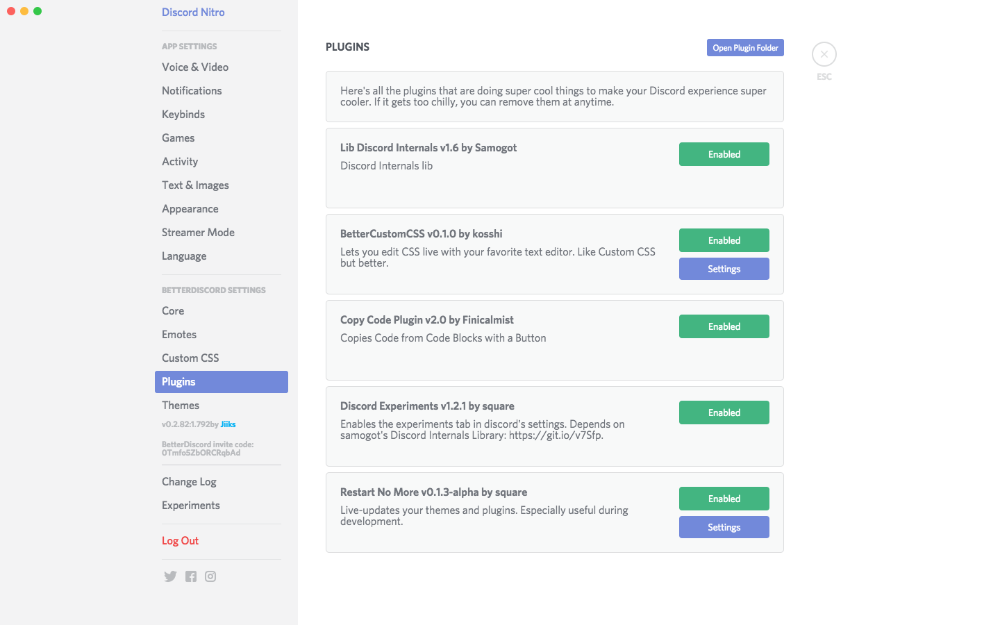

BetterDiscord CSS fixes
===

Makes the BetterDiscord settings pages look just like the normal Discord settings pages. Works with both the dark and light themes. Also fixes a few things.

Installation
---

Save the file `bd-fixes.theme.css` from the [releases][] page to the BetterDiscord themes folder and restart Discord (unless you have a plugin like [Restart No More](https://github.com/Inve1951/BetterDiscordStuff/blob/master/plugins/restartNoMore.plugin.js)).

[releases]: https://github.com/samuelthomas2774/bd-fixes/releases

Screenshots
---

